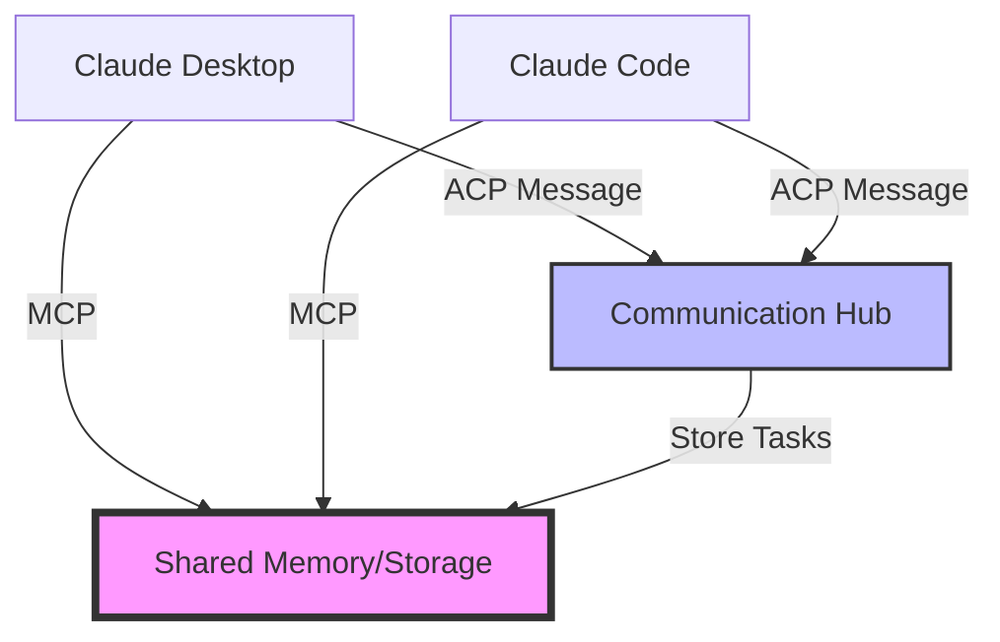

# ACP vs MCP: Comparison for Claude Unification

## Overview

- **MCP (Model Context Protocol)**: Enriches a single model with tools, memory, and resources
- **ACP (Agent Communication Protocol)**: Enables communication between multiple independent agents

## Detailed Comparison

### 1. **Primary Purpose**

| MCP | ACP |
|-----|-----|
| Connects Claude to external tools/memory | Connects Claude Desktop to Claude Code |
| **Focus**: One model, many tools | **Focus**: Many agents, peer communication |
| Gives Claude persistent memory | Gives Claudes a way to talk to each other |

### 2. **Architecture**

**MCP Architecture:**
```
Claude Instance
    ↓
MCP Server (mem0, storage)
    ↓
Resources (memory, files, tools)
```

**ACP Architecture:**
```
Claude Desktop ←→ Communication Hub ←→ Claude Code
     ↓                    ↓                    ↓
   Design              Messages            Implement
```

### 3. **How They Work Together**



### 4. **Message Types**

**MCP Messages** (Tool Calls):
```json
{
  "method": "tools/call",
  "params": {
    "name": "store_memory",
    "arguments": {
      "content": "Remember this design",
      "category": "design"
    }
  }
}
```

**ACP Messages** (Agent Communication):
```json
{
  "from": "claude-desktop",
  "to": "claude-code",
  "task_type": "implement_feature",
  "parts": [
    {
      "content_type": "artifact",
      "content": "design specification",
      "name": "design"
    },
    {
      "content_type": "reference",
      "content_url": "mcp://jarvis-memory/design-123",
      "name": "memory_ref"
    }
  ]
}
```

## How They Unify Your System

### 1. **Complementary Roles**

- **MCP** = The memory and tools each Claude can access
- **ACP** = The language Claudes use to coordinate

Think of it like:
- **MCP**: Each Claude's brain (memory, knowledge, tools)
- **ACP**: The nervous system connecting the brains

### 2. **Unified Workflow**

```python
# 1. Claude Desktop creates a design
design = create_design()

# 2. Store in shared memory via MCP
mcp.call_tool("store_memory", {
    "content": design,
    "id": "design-123"
})

# 3. Send task to Claude Code via ACP
acp.send_message({
    "to": "claude-code",
    "task": "implement",
    "memory_ref": "mcp://jarvis-memory/design-123"
})

# 4. Claude Code retrieves from memory via MCP
design = mcp.call_tool("retrieve_memory", {
    "id": "design-123"
})

# 5. Implements and stores result
mcp.call_tool("store_memory", {
    "content": implementation,
    "id": "impl-123"
})
```

### 3. **Benefits of Using Both**

| Feature | MCP Only | MCP + ACP |
|---------|----------|-----------|
| Persistent Memory | ✅ Each Claude has memory | ✅ Shared memory + coordination |
| Task Handoff | ❌ Manual copy/paste | ✅ Automated with tracking |
| Context Sharing | ⚠️ If both access same memory | ✅ Explicit context passing |
| Work Tracking | ❌ No built-in tracking | ✅ Task queue with status |
| Collaboration | ❌ Independent operation | ✅ Coordinated workflow |

## Practical Implementation Strategy

### Step 1: MCP for Shared Resources
```python
# Both Claudes access same memory
@jarvis-memory.store_memory("design-neural-cache", content)
@jarvis-memory.retrieve_memory("design-neural-cache")
```

### Step 2: ACP for Coordination
```python
# Claude Desktop
task = create_task("implement-neural-cache")
task.add_memory_reference("design-neural-cache")
send_to_claude_code(task)

# Claude Code  
task = receive_task()
design = retrieve_from_memory(task.memory_ref)
implement(design)
```

### Step 3: Combined Protocol
```python
class UnifiedClaudeProtocol:
    def __init__(self):
        self.mcp = MCPClient()  # For memory/storage
        self.acp = ACPClient()  # For communication
    
    async def handoff_design_to_implementation(self, design):
        # Store in shared memory via MCP
        memory_id = await self.mcp.store_memory({
            "content": design,
            "type": "design",
            "timestamp": datetime.now()
        })
        
        # Create handoff task via ACP
        task = await self.acp.create_task({
            "from": "claude-desktop",
            "to": "claude-code", 
            "action": "implement",
            "memory_reference": memory_id,
            "priority": "high"
        })
        
        return task.id
```

## Real-World Example

### Without Integration:
1. Claude Desktop creates design → You copy it
2. You paste to Claude Code → Context lost
3. No tracking of what was implemented

### With MCP Only:
1. Claude Desktop stores design in memory
2. You tell Claude Code to retrieve it
3. Still manual coordination

### With MCP + ACP:
1. Claude Desktop creates design
2. Automatically stores in MCP memory
3. Sends ACP task to Claude Code
4. Claude Code gets notification
5. Retrieves design from memory
6. Implements and updates status
7. Both can track progress

## Conclusion

**Yes, MCP and ACP together will significantly help unify your systems!**

- **MCP** provides the shared brain (memory/storage)
- **ACP** provides the communication pathway
- Together they create a true multi-agent AI system

Think of it as:
- **MCP** = Hard drive (persistent storage)
- **ACP** = Network protocol (communication)
- **Together** = Distributed AI system

This combination gives you:
1. ✅ Persistent shared memory
2. ✅ Structured task handoffs
3. ✅ Progress tracking
4. ✅ Context preservation
5. ✅ Automated workflows

The protocols are complementary, not competing!